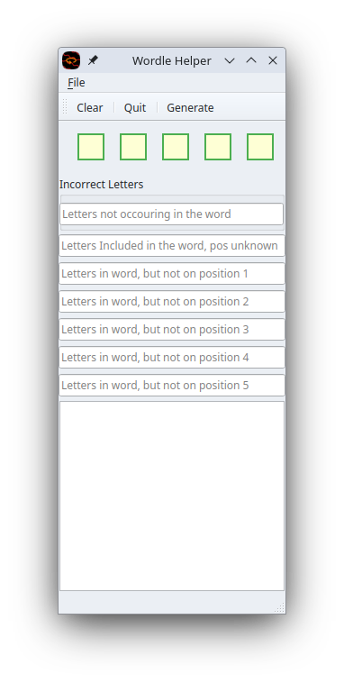

# wordle-helper
A wordle helper to solve Wordle problems.

## Build

git clone https://github.com/aksmat/wordle-helper.git
mkdir build
cd build
qmake ../wordle-helper.pro
make 

## Dependencies

### Ubuntu/Kubuntu 24.04
sudo apt install qt6-base-dev qt6-tools-dev

## Screenshots

### Starting Screen

### Game In Progress

For the Game state

the helper would be:

### Game Finished

[Game Finished](screenshots/game-state-finished.png)

[Game Finished](screenshots/finished.png)
